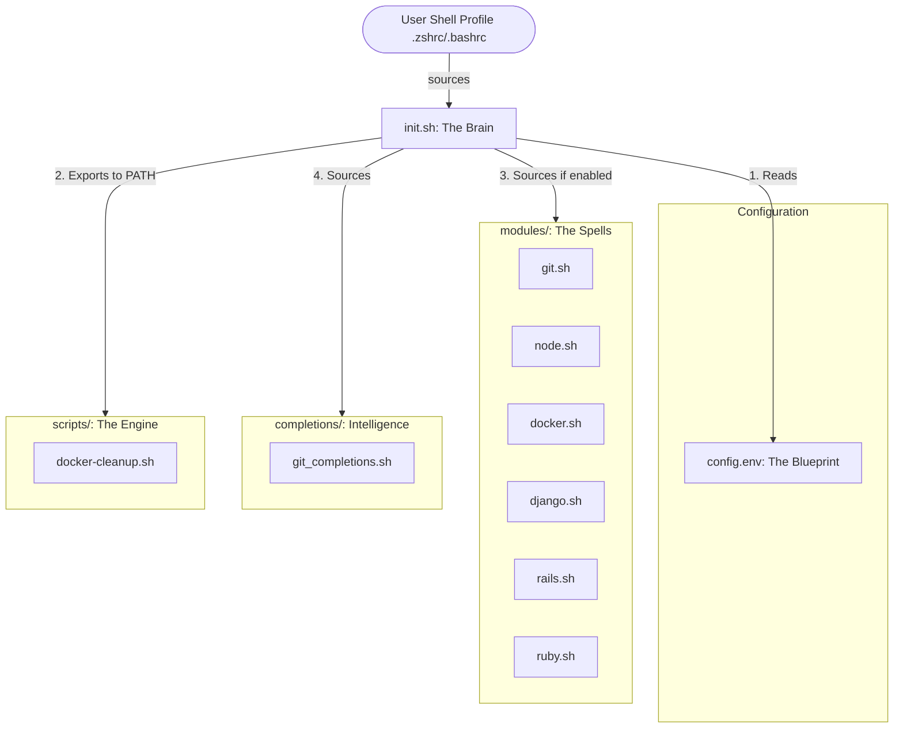

# Project Big Picture: bash-wizardry 🧙‍♂️

## 🎯 Purpose
**bash-wizardry** is a curated suite of command-line tools and utilities for Bash and Zsh. It aims to transform standard terminal workflows into high-speed, intelligent "spells" while maintaining a high standard of security and transparency. The project focuses on developer productivity across various modern technology stacks.

---

## 🔑 Main Keys
- **Intelligent Context-Awareness**: Commands like `ni` or `nr` automatically detect whether you are using `npm`, `yarn`, or `pnpm`.
- **Safety First**: Destructive operations (e.g., `git reset --hard`, `git branch -D`) include confirmation prompts to prevent accidental data loss.
- **Unified Syntax**: Provides consistent commands for common tasks across different ecosystems (e.g., unified Node.js commands).
- **Total Transparency**: 100% script-based with no hidden binaries. Installation is a simple `source` line in your `.zshrc` or `.bashrc`.
- **Zero Configuration**: Works out of the box but remains highly customizable through a simple environment file.

---

## 🛠️ Tools & Ecosystem
- **Core**: Bash & Zsh Shell Scripting.
- **Target Workflows**:
    - **VCS**: Git (advanced syncing, history manipulation).
    - **JS/TS**: Node.js ecosystem (npm, yarn, pnpm).
    - **Contanierization**: Docker (interactive container management).
    - **Full-Stack**: Ruby on Rails & Django (database management, scaffolding).

---

## 📦 Modules
The project is divided into specialized modules, each residing in the `modules/` directory:

| Module | Core Functionality | Key Commands |
| :--- | :--- | :--- |
| **Git** | Streamlined syncing, branching, and safety. | `gup`, `gclean`, `gundo`, `gbd` |
| **Node.js** | Manager-agnostic package & script management. | `ni`, `na`, `nr`, `n-reinstall` |
| **Docker** | Interactive container interaction & cleanup. | `dkrinto`, `dkrlogs`, `dkrclean` |
| **Django** | Smart app creation and enhanced shell. | `djstartapp`, `djshell` |
| **Rails** | Safe database resets and sandbox consoles. | `rdbreset`, `rcs` |
| **Ruby** | Version management and gem shortcuts. | `bi`, `be` |

---

## 🏗️ Architecture & Structure
The project follows a modular, non-intrusive architecture designed for easy integration and performance.

### Visual Structure & Flow

### Folder Structure
- `init.sh`: The **Brain**. Automatically calculates paths, updates headers, and sources all active modules.
- `modules/`: The **Spells**. Contains independent script files for each technology.
- `completions/`: The **Intelligence**. Enhances shell autocompletion (e.g., git branch names).
- `scripts/`: The **Engine**. Standalone helper scripts added directly to the user's `$PATH`.
- `config.env.example`: The **Blueprint**. Template for user-specific module toggling and settings.

### Loading Flow
1. User sources `init.sh` in their shell profile.
2. `init.sh` detects its own absolute path to ensure portability.
3. It exports `scripts/` to the global `PATH`.
4. It reads `config.env` to check which modules are enabled (e.g., `BW_ENABLE_DOCKER=true`).
5. It loops through `modules/*.sh` and sources each one if enabled.
6. Custom shell completions from `completions/` are loaded to assist the user.
